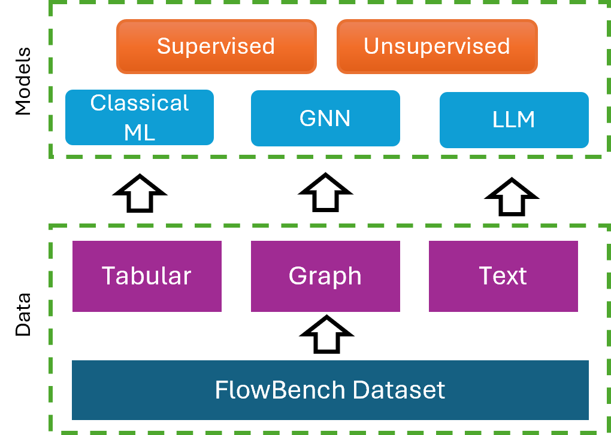

# Flow-Bench: A Dataset for Computational Workflow Anomaly Detection

Flow-Bench is a benchmark dataset for anomaly detection techniques in computational workflows.
Flow-Bench contains workflow execution traces, executed on distributed infrastructure, that include systematically injected anomalies (labeled), and offers both the raw execution logs and a more compact parsed version. 
In this GitHub repository, apart from the logs and traces, you will find sample code to load and process the parsed data using pytorch, as well as, the code used to parse the raw logs and events.

## Dataset

The dataset contains 6352 DAG executions from 11 computational science workflows and 1 ML data science workflow, under normal and anomalous conditions. These workflows were executed using [Pegasus WMS - Panorama](https://github.com/pegasus-isi/pegasus/tree/panorama). Synthetic anomalies, were injected using Docker’s runtime options to limit and shape the performance. The data have been labeled using 6 tags (normal, cpu_2, cpu_3, cpu_4, hdd_5 and hdd_10).

- *normal*: No anomaly is introduced - normal conditions.
- *CPU K*: M cores are advertised on the executor nodes, but on some nodes, K cores are not allowed to be used. (K = 2, 3, 4M = 4, 8 and K < M)
- *HDD K*: On some executor nodes, the average write speed to the disk is capped atK MB/s and the read speed at (2×K) MB/s. (K = 5, 10)

Detailed description and statistics of the dataset can be found in [./adjacency_list_dags/README.md](./adjacency_list_dags/README.md)

## Benchmark Installation

* Install the required packages by using `bash setup.sh`

## Benchmark Instructions

* load data as graphs in `pytorch_geometric` format:
  
  ```python
  from flowbench.dataset import FlowDataset
  dataset = FlowDataset(root="./", name="montage")
  data = dataset[0]
  ```
  
  The `data` contains the structural information by accessing `data.edge_index`, and node feature information `data.x`.

* load data as tabular data in `pytorch` format:

  ```python
  from flowbench.dataset import FlowDataset
  dataset = FlowDataset(root="./", name="montage")
  data = dataset[0]
  Xs = data.x
  ys = data.y
  ```

  Unlike the graph `data`, the `data` only contains the node features.

* load data as tabular data in `numpy` format:

  ```python
  from flowbench.dataset import FlowDataset
  dataset = FlowDataset(root="./", name="montage")
  data = dataset[0]
  Xs = data.x.numpy()
  ys = data.y.numpy()
  ```

  This is the same as the previous one, but the data is in `numpy` format, which is typically used in the models from `sklearn` and `xgboost`.

## Benchmark Methods

* __unsupervised__: We provide benchmarks for anomaly detection based on [PyGOD](https://docs.pygod.org/en/latest/index.html) and [PyOD](https://pyod.readthedocs.io/en/latest/index.html) from graph data and tabular data, respectively.
  * Checkout the script under `./example/demo_pygod.py` and `./example/demo_pyod.py` for more details.
* __supervised__: We provide supervised methods for both tabular and graph data
  * Checkout the script under `./example/demo_mlp.py` and `./example/demo_gnn.py` for more details.
* __supervised fine-tuned (SFT) LLMs__: We provide text data based anomaly detection using fine-tuned language models with LoRA for efficient training.
  * Checkout the script under `./example/demo_sft_lora.py` for more details.


<p align="center">

</p> 

## Repository Structure

The repository is structured as follows:
- *adjacency_list_dags*: Contains json files of the executable workflow DAGs in adjacency list representation.
- *images*: Contains diagrams of the abstract workflow DAGs and of the processes used to generated the data.
- *parsed*: Contains the parsed version of the data. The folder is structured in subfolders per anomaly label.
- *py_script*: Contains scripts to load the dataset and run the benchmark.
- *raw*: Contains the raw logs and scripts to parse them.

```
.
├── adjacency_list_dags
├── benchmark
├── data 
│   ├── xxx.zip
├── examples
|   └── demo_xxx.py
├── flowbench
│   ├── nlp
│       ├── llm.py
│   ├── supervised
|   |   ├── mlp.py
|   |   ├── gnn.py
|   |   └── xxx.py
│   └── unsupervised
|       ├── gmm.py
|       ├── pca.py
|       └── xxx.py
├── hps/
├── tests/
├── LICENSE
├── README.md
├── requirements.txt
├── setup.py
```


## LICENSE

The dataset is licensed under the [Creative Commons Attribution 4.0 International License](https://creativecommons.org/licenses/by/4.0/).
The code is licensed under the [MIT License](https://opensource.org/licenses/MIT).