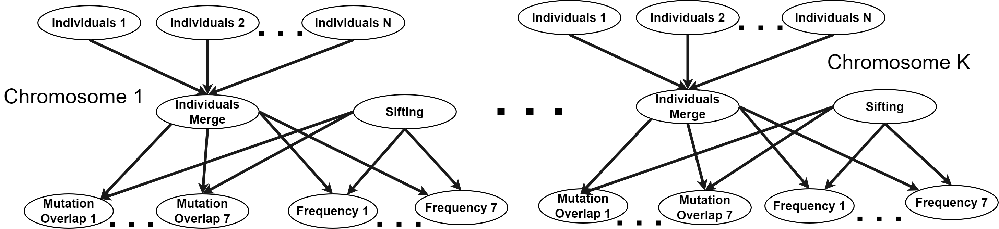
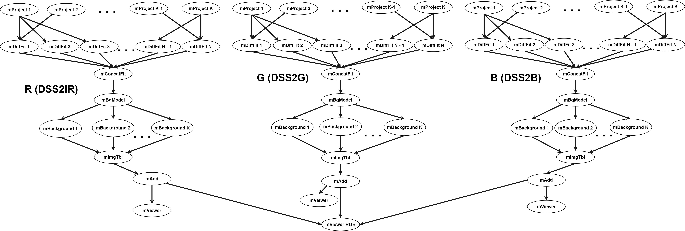
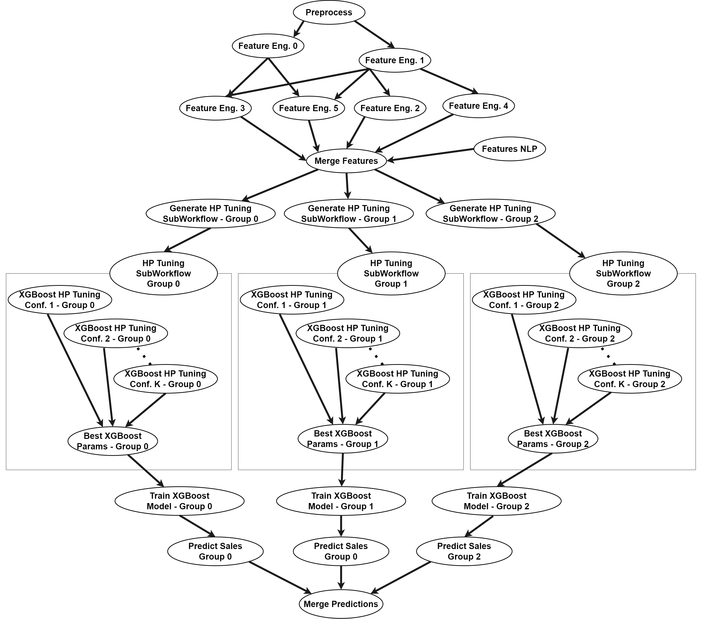

## Workflow DAGs

### Overview

<table>
<thead>
<tr>
<th rowspan="3">Workflow</th>
<th colspan="2">DAG Information</th>
<th colspan="6">#DAG Executions</th>
<th colspan="6">#Total Nodes per Type</th>
</tr>
<tr>
<th rowspan="2">Nodes</th>
<th rowspan="2">Edges</th>
<th rowspan="2">Normal</th>
<th colspan="3">CPU</th>
<th colspan="2">HDD</th>
<th rowspan="2">Normal</th>
<th colspan="3">CPU</th>
<th colspan="2">HDD</th>
</tr>
<tr>
<th>2</th>
<th>3</th>
<th>4</th>
<th>5</th>
<th>10</th>
<th>2</th>
<th>3</th>
<th>4</th>
<th>5</th>
<th>10</th>
</tr>
</thead>
<tbody>
<tr>
<td>1000 Genome</td>
<td>137</td>
<td>289</td>
<td>50</td>
<td>100</td>
<td>25</td>
<td>-</td>
<td>100</td>
<td>75</td>
<td>32261</td>
<td>5173</td>
<td>756</td>
<td>-</td>
<td>5392</td>
<td>4368</td>
</tr>
<tr>
<td>Montage</td>
<td>539</td>
<td>2838</td>
<td>51</td>
<td>46</td>
<td>80</td>
<td>-</td>
<td>67</td>
<td>76</td>
<td>137229</td>
<td>4094</td>
<td>11161</td>
<td>-</td>
<td>8947</td>
<td>11049</td>
</tr>
<tr>
<td>Predict Future Sales</td>
<td>165</td>
<td>581</td>
<td>100</td>
<td>88</td>
<td>88</td>
<td>88</td>
<td>88</td>
<td>88</td>
<td>72609</td>
<td>3361</td>
<td>3323</td>
<td>3193</td>
<td>3321</td>
<td>3293</td>
</tr>
<tr>
<td>Variant Calling</td>
<td>371</td>
<td>792</td>
<td>80</td>
<td>80</td>
<td>80</td>
<td>-</td>
<td>75</td>
<td>80</td>
<td>115588</td>
<td>8287</td>
<td>7222</td>
<td>-</td>
<td>7365</td>
<td>8083</td>
</tr>
<tr>
<td>CASA Wind Speed</td>
<td>162</td>
<td>342</td>
<td>150</td>
<td>200</td>
<td>200</td>
<td>-</td>
<td>200</td>
<td>160</td>
<td>116836</td>
<td>8793</td>
<td>8382</td>
<td>-</td>
<td>8305</td>
<td>5104</td>
</tr>
<tr>
<td>CASA Nowcast</td>
<td>2081</td>
<td>4029</td>
<td>101</td>
<td>80</td>
<td>78</td>
<td>-</td>
<td>79</td>
<td>83</td>
<td>685045</td>
<td>49960</td>
<td>46664</td>
<td>-</td>
<td>46104</td>
<td>48328</td>
</tr>
<tr>
<td>CASA Nowcast Small</td>
<td>419</td>
<td>795</td>
<td>80</td>
<td>80</td>
<td>80</td>
<td>-</td>
<td>80</td>
<td>79</td>
<td>128562</td>
<td>10031</td>
<td>9592</td>
<td>-</td>
<td>9427</td>
<td>9569</td>
</tr>
<tr>
<td>Soil Moisture</td>
<td>60</td>
<td>185</td>
<td>125</td>
<td>98</td>
<td>97</td>
<td>-</td>
<td>92</td>
<td>93</td>
<td>24408</td>
<td>1706</td>
<td>1428</td>
<td>-</td>
<td>1344</td>
<td>1414</td>
</tr>
<tr>
<td>PyCBC Inference</td>
<td>17</td>
<td>26</td>
<td>206</td>
<td>89</td>
<td>74</td>
<td>-</td>
<td>67</td>
<td>66</td>
<td>6970</td>
<td>549</td>
<td>326</td>
<td>-</td>
<td>388</td>
<td>301</td>
</tr>
<tr>
<td>PyCBC Search</td>
<td>368</td>
<td>1025</td>
<td>102</td>
<td>100</td>
<td>100</td>
<td>-</td>
<td>104</td>
<td>100</td>
<td>151004</td>
<td>9495</td>
<td>9039</td>
<td>-</td>
<td>8324</td>
<td>8346</td>
</tr>
<tr>
<td>EHT Difmap</td>
<td>33</td>
<td>59</td>
<td>142</td>
<td>93</td>
<td>88</td>
<td>-</td>
<td>89</td>
<td>89</td>
<td>13000</td>
<td>1059</td>
<td>737</td>
<td>-</td>
<td>877</td>
<td>860</td>
</tr>
<tr>
<td>EHT Imaging</td>
<td>12</td>
<td>18</td>
<td>212</td>
<td>76</td>
<td>74</td>
<td>-</td>
<td>70</td>
<td>69</td>
<td>4908</td>
<td>354</td>
<td>241</td>
<td>-</td>
<td>261</td>
<td>248</td>
</tr>
<tr>
<td>EHT Smili</td>
<td>16</td>
<td>26</td>
<td>148</td>
<td>87</td>
<td>84</td>
<td>-</td>
<td>90</td>
<td>93</td>
<td>6471</td>
<td>437</td>
<td>325</td>
<td>-</td>
<td>382</td>
<td>417</td>
</tr>
</tbody>
</table>

### 1000 Genome Workflow

The 1000 genome project provides a reference for human variation, having reconstructed the genomes of 2,504 individuals across 26 different populations. The test case we have here, identifies mutational overlaps using data from the 1000 genomes project in order to provide a null distribution for rigorous statistical evaluation of potential disease-related mutations. The implementation of the worklfow can be found here: https://github.com/pegasus-isi/1000genome-workflow.

### Montage Workflow

Montage is an astronomical image toolkit with components for re-projection, background matching, co-addition, and visualization of FITS files. Montage workflows typically follow a predictable structure based on the inputs, with each stage of the workflow often taking place in discrete levels separated by some synchronization/reduction tasks. The implementation of the workflow can be found here:  https://github.com/pegasus-isi/montage-workflow-v3.

### Predict Future Sales Workflow

The predict future sales workflow provides a solution to Kaggle’s predict future sales competition. The workflow receives daily historical sales data from January 2013 to October 2015 and attempts to predict the sales for November 2015. The workflow includes multiple preprocessing and feature engineering steps to augment the dataset with new features and separates the dataset into three major groups based on their type and sales performance. To improve the prediction score, the workflow goes through a hyperparameter tuning phase and trains 3 discrete XGBoost models for each item group. In the end, it applies a simple ensemble technique that uses the appropriate model for each item prediction and combines the results into a single output file. The implementation of the workflow can be found here: https://github.com/pegasus-isi/predict-future-sales-workflow.

<!-- TODO: add more workflows -->
