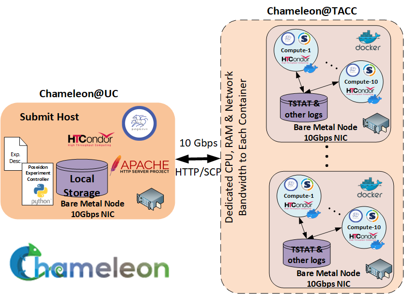
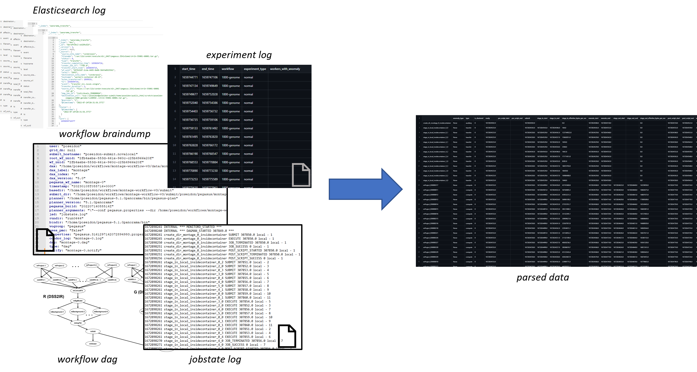

# Raw Data

To generate the raw logs, we provisioned resources at the [NSF Chameleon Cloud](https://www.chameleoncloud.org/). We provisioned 4 Cascade Lake bare-metal nodes (48 Cores and 192GB RAM), where 1 had the role of submit node and 3 had the role of Docker container executor nodes. The container executor nodes were located within the same Chameleon region (Texas Advanced Computing Center - TACC), while the submit node was located at the University of Chicago region, and the connectivity between the two regions was established over a high-speed layer 2 VLAN (10 Gbps). 



In the raw data you can find:
- *workflows.tar.xz*: the workflows and the configurations used to execute them.
- *archive/workflow-submit-dirs.tar.xz.partX*: the workflow submit directories of all DAG executions, containing workflow management system logs, and provenance data.
- *archive/elasticsearch.tar.xz.partX*: an elasticsearch with the captured workflow events, transfer events and resource utilization traces.


## Parsing the raw data

To parse ther raw data there are dependencies on **Docker** and **Docker Compose**, since elasticsearch runs in a container. Total space requirement on disk is 50GB.<br>
`run_parser.sh` untars the tar.xz files, creates a python environment with the needed packages, starts up the elasticsearch instance and goes through the workflow submit directories 
to generated the parsed data. The parsed data will be saved in the ./output folder. For a detailed description of the events and logs please refer to [Pegasus' Documentation](https://pegasus.isi.edu/documentation/reference-guide/monitoring.html?highlight=events).



To generate the parsed data invoke the the following command:

```
bash run_parser.sh
```
